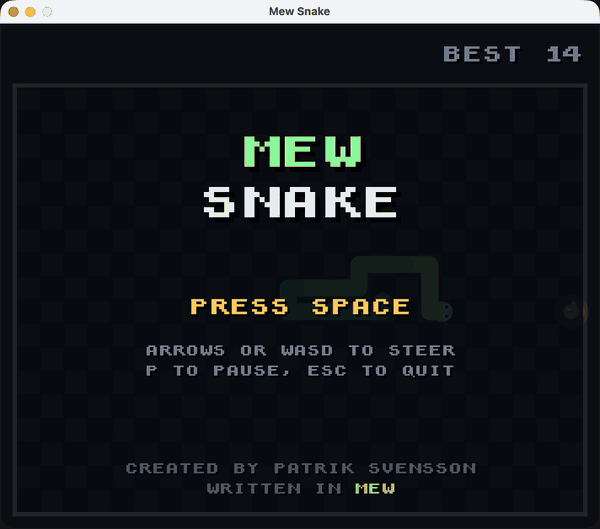

# Mew Snake

A small experiment to create something concrete using the Mew programming language.  
Made possible with SDL 3 and Sokol, which are two pretty awesome libraries.



You will need the .NET 10 SDK installed on your machine.  
It currently only works on macOS (Apple silicon).

## Building

Install SDL 3:

```shell
brew install sdl3
```

Install Mew:

```shell
dotnet tool install -g mew --prerelease
```

Then build:

```shell
mew build
```

## Playing

```shell
mew build play
```

A gamepad, such as a PS5 or Xbox controller, works too. Steer with the d-pad
or the left stick, press any other button to play, and Options/Start to pause.
Press F to toggle full screen.
Reach the top 10 to put your initials on the high score list, picking each
letter with up and down.
